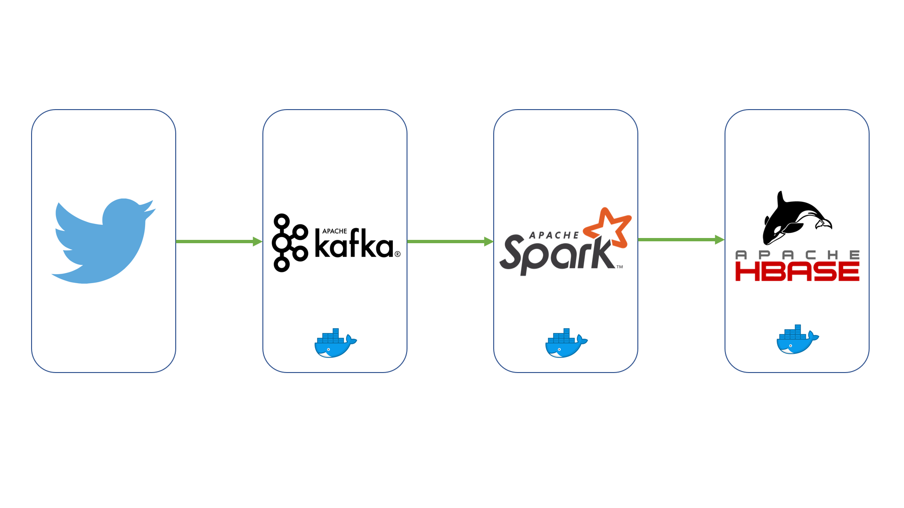

# Big Data Course Project
## Kafka-Spark-HBase Twitter Sentiment-Analysis


## Description
This project is done for my course work in Big Data Technology, it shows a basic implementation of a Big data workflo using certain big data technologies such as Apache Kafka, Apache Zookeeper, Apache Spark and Apache Hbase. <br/> 

This core analysis done in this project is a very trivial computation on a stream of tweets fetched from a twitter api in real time. 
It will compute the score of each tweet by weighing the amount of negative and/or positve words used in the tweet. I have used a set of predefined set of positive and neagtive words to do the filtering on the stream of tweets.

## Architecture



The architecture consists of an ingestion and processing modules The result is stored in a database for further querying and visualization.

## Environment Setup
* I used an Unbuntu18 VM running on VMware
* Install Java 8+
* Install docker: you can use this script https://get.docker.com/
```
$ curl -fsSL https://get.docker.com -o get-docker.sh
$ sh get-docker.sh
```
* Install docker-compose

## Steps
1. [Clone the repo](#1-clone-the-repo)
2. [Create twitter deveoper account and get the keys](#2-setup-twitter-developer-acesss)
3. [Set up the infrastructure](#3-set-up-the-infrastructure)
4. [Launch the Ingestion Module](#4-launch-the-ingestion-module)
5. [Launch the Processing Module](#5-launch-the-processing-module)
6. [Visualize the results](#6-visualize-the-results)

### 1. Clone the repo

Clone this repository. In a terminal, run:

```bash
$ git clone https://github.com/robivictor/twitter_kafka_spark_hbase.git
```

### 2. Setup twitter developer acesss
You need to setup a developer account and create an app to get these four keys
*  **apiKey** 
* **apiSecret** 
* **accessToken**
* **accessTokenSecret**

Set these values in the **TwitterConfig** file inside **Ingestion/src/msin/java/config/**.

### 3. Set up the infrastructure
I used a dockerized environment on top of an Ubuntu18 vm running on Windows 10. I used VMware with 16GB RAM and 6 CPU cores assigned to the VM. There are four docker containers involved which will be easily spinned up by docker-compose. 

The docker-compose.yml file launches 
* Apache Kafka (a Kafka Broker and Apache Zookeeper)
* Apache Spark (a Driver container and 2 worker containers)
* Apache HBase.

I used Hbase in standalone mode. In this case, HBase does not use HDFS — it uses the local filesystem instead — and it runs all HBase daemons and a local ZooKeeper all up in the same JVM.

The docker-compose.yml is based on these images, most of the setup is done on the images. The credit goes to them.
 * [wurstmeister/kafka](https://github.com/wurstmeister/kafka-docker)
 * [singularities/spark](https://hub.docker.com/r/singularities/spark/)
 * [ziedyazidi/hbase](https://hub.docker.com/r/ziedyazidi/hbase) based on [dajobe/hbase](https://github.com/dajobe/hbase-docker).

All you need to do in this section is launch the docker compose file as follows:
```bash
$ docker-compose up
```
Run this script to map the IP addresses to named adresses.
To launch the script:
```bash
$ ./updateHosts.sh
```

### 4. Launch the Ingestion Module
This is a java based module which consumes the twitter stream and send it to a Kafka Topic. 
It contains a producer that authenticates to the Twitter API, constructs models based on the stream schema and connects to the kafka broker to save the stream. 

Run the Main Class **KafkaRunner.java**

### 5. Launch the Processing Module
This module is composed of 3 parts: kafka stream consumption, stream processing and hbase sink.
The kafka consumer consumes the tweets from the Kafka topic. A score is computed for each tweet using Spark Streaming (See SentimenetAnalysis.java)

The result is saved to hbase using the **hbase-spark** connector.

You need to create the **tweets** table and the column families **content** and **rating** in Apache Hbase before launchning the module:

```bash
$ create 'tweets', 'content', 'rating'
```

### 6. Visualize and query the results
You can add tools like Apache Zeppelin, Tableau, Qlink, ... to be able to query and visualize the data stored in Apache HBase. 
